# Welcome

This guide walks you through your first month of bookkeeping in LineLedger, from a brand-new account to a reconciled bank statement and a clean set of month-end reports.

We follow a small, real-world story: the **Edgemont Photo Club**, an unincorporated association in North Vancouver, British Columbia. Riley Park, the club's volunteer treasurer, sets the club up in LineLedger on January 1, 2026. During January the club:

1. Creates its organization with a standard non-profit chart of accounts
2. Sets up a **Founding Member** membership level at **$10 per year**
3. Welcomes its first member, **Alex Tremblay**, and invoices their dues
4. Collects the $10 in cash and deposits it at the bank
5. Reconciles the January bank statement, which includes a **$2 bank service charge**
6. Reads the month-end reports: balance sheet, income statement, cash flow, and the membership roster

By January 31 the club's books show exactly what happened: **$10 of membership revenue, $2 of bank charges, and $8 in the bank** — proven against the bank statement to the penny.

Nothing in this guide requires an accounting background. Where a bookkeeping idea matters (and only where it matters), a short *Why this matters* note explains it in plain language.

> **Note.** LineLedger's interface says **organization** for what accountants might call the company, entity, or society. They are the same thing. This guide says organization throughout.

> **Tip.** Every number, name, and date in this guide comes from a real LineLedger session — the screenshots are unretouched. Follow along with your own club's details and your screens will match.

# Create Your Account and Organization

Everything starts at the registration page. If your club is self-hosting LineLedger, browse to your server's address; otherwise use your LineLedger provider's sign-in page.

## Register

Click **Create account** on the login page (or browse to `/register`) and fill in your name, email address, and a password. Tick the terms checkbox and click **Create account**.

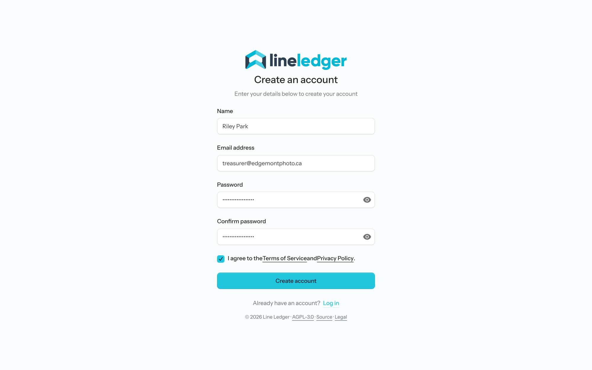
*Figure 1 — Registering the treasurer's account.*

> **Note.** You may be asked to accept the Terms of Service and Privacy Policy again
> later, if they've been updated since you signed up. It's a one-click prompt and it
> won't cost you any work in progress.

## The setup wizard

A new account with no organizations lands directly in the eight-step setup wizard. The steps are listed down the left side; each one is a quick decision, and the wizard tells you when something can be changed later.

*Figure 2 — The setup wizard. Eight small steps, most with sensible defaults.*

## Step 1 — Organization info

Enter the organization name and where it operates. For the Edgemont Photo Club:

| Field | Value |
|---|---|
| Organization name | Edgemont Photo Club |
| Country | Canada |
| Province | British Columbia |
| Base currency | CAD — Canadian Dollar |
| Timezone | America/Vancouver *(detected automatically)* |
| Fiscal year start month | January |

*Figure 3 — Organization info. Note the confirmation under the last field: "Your fiscal year-end is December 31."*

> **Tip.** The **fiscal year start month** controls how reports group your years. Most clubs run on the calendar year — start month January, year-end December 31 — which is what we chose. If your association's bylaws set a different year-end, pick the month your fiscal year *begins*.

## Step 2 — How is your organization organized?

Choose **Non-profit or charity**. A second question appears asking for your legal structure — choose **Unincorporated association**, which is what most small clubs are: a group of people with a constitution and an executive, but no incorporation papers.

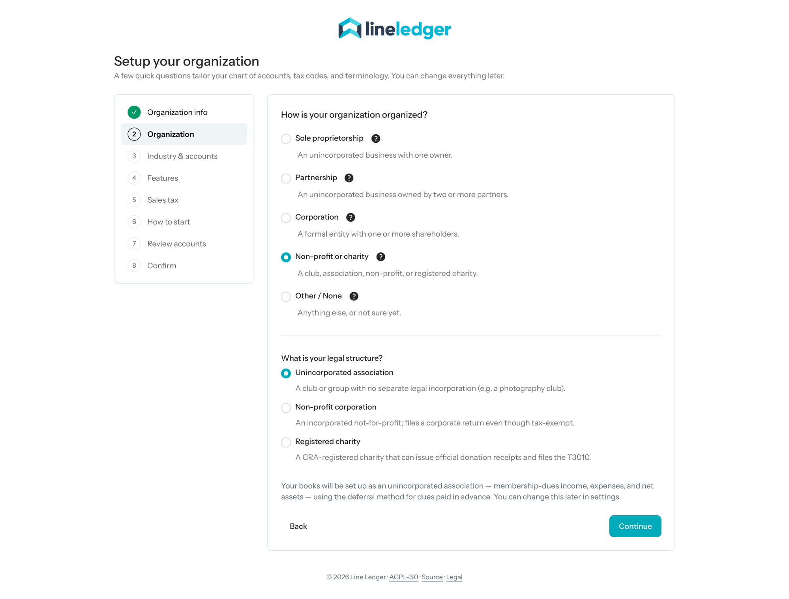
*Figure 4 — Non-profit or charity, then Unincorporated association.*

> **Why this matters.** This single choice tunes the vocabulary of your books. Equity becomes **Net Assets**, the bottom line of your income statement becomes **Excess (deficiency) of revenue over expenses**, and there are no owner draws or share capital anywhere — because a club has none. Registered charities get extra fields (a CRA registration number and a choice of contribution-accounting methods); an unincorporated association keeps it simple.

## Step 3 — Industry and accounts

Keep **Standardized accounts** selected, and choose **Non-profit** as the industry. This is what builds your standard chart of accounts in the next steps — including accounts like *Membership Dues* and *Donations & Contributions* that a generic business chart wouldn't have.

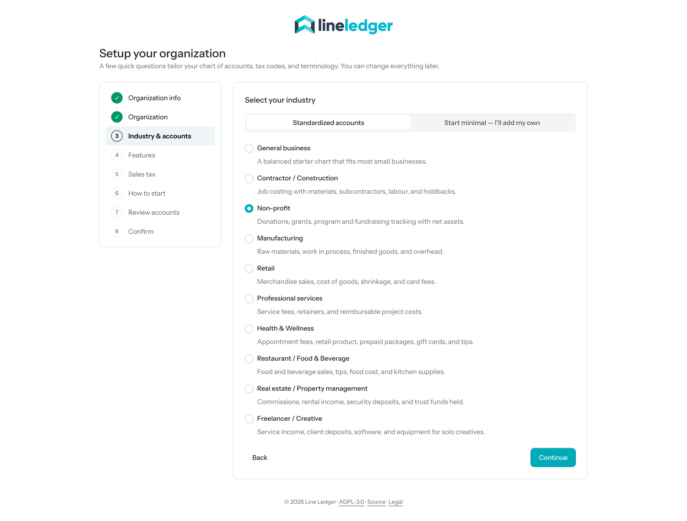
*Figure 5 — Standardized accounts with the Non-profit industry template.*

## Step 4 — Features

LineLedger pre-selects a sensible feature set for a non-profit. Keep **Membership** switched on — it adds Members, membership levels, dues billing, and the membership roster report. We switched the other suggestions off; the photo club has no employees or fixed assets yet, and any feature can be turned on later in settings.

*Figure 6 — Membership is the one feature this club needs from day one.*

## Step 5 — Sales tax

The Edgemont Photo Club is **not registered for GST/HST** — like most small associations under the $50,000 small-supplier threshold — so switch **I charge GST/HST** off.

*Figure 7 — Not GST-registered: leave the toggle off.*

> **Tip.** If your association registers for GST later, you can turn tax collection on in settings at any time. With the toggle off, invoices simply have no tax column and no tax accounts are created.

## Step 6 — How to start

Choose **Start fresh** and set the start date to the first day of your fiscal year — **January 1, 2026** for the club. Transactions you record will begin from this date.

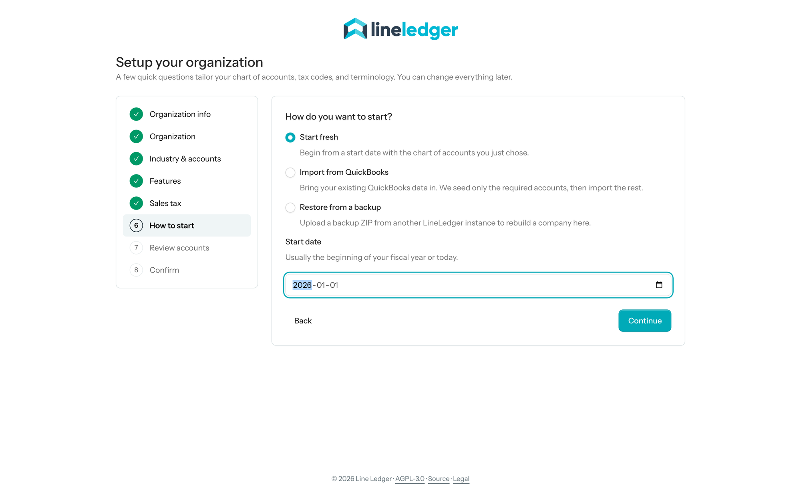
*Figure 8 — Starting fresh as of January 1, 2026.*

> **Tip.** Set the start date even if you're doing your setup partway through the year. It marks where your LineLedger books begin.

## Step 7 — Review your chart of accounts

The wizard shows the chart of accounts it's about to create — about thirty accounts tailored to a Canadian non-profit. Required system accounts are locked on; optional ones can be unticked. The defaults are good: keep them all.

*Figure 9 — The standard non-profit chart, including 4200 Membership Dues.*

## Step 8 — Confirm

A summary of every choice. Check it over and click **Create organization**.

*Figure 10 — Ready to create: Canada · CAD, Club / Association, Unincorporated association, Non-profit chart.*

## Your new dashboard

A few seconds later you land on the dashboard: cash on hand, receivables, payables, and a six-month cash-flow chart — all zeros, which is exactly right for a brand-new set of books. The blue card at the top is a short stack of getting-started tips; each one links to the page it describes and can be marked done as you go.

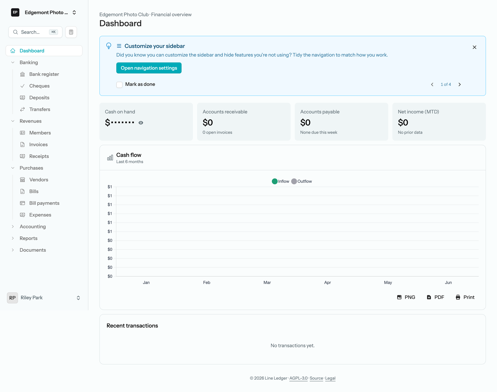
*Figure 11 — A fresh organization. The sidebar already shows Members under Revenues because the Membership feature is on.*

# Meet Your Chart of Accounts

Open **Accounting → Chart of Accounts** (or browse to *Accounts*). Everything the wizard promised is here, organized the way accountants expect — assets, liabilities, net assets, income, and expenses.

> **Why this matters.** Every dollar in LineLedger lives in exactly one account, and every transaction moves dollars between two or more of them — that's all double-entry bookkeeping is. You'll see it in action in the chapters ahead; the chart is simply the list of places money can be.

The accounts this guide touches:

| Code | Account | What it holds |
|---|---|---|
| 1000 | Chequing | The club's bank account |
| 1100 | Accounts Receivable | Dues invoiced but not yet collected |
| 1200 | Undeposited Funds | Cash collected but not yet taken to the bank |
| 4200 | Membership Dues | Dues revenue |
| 2510 | Deferred Membership Dues | Dues collected for future periods (not needed this month) |
| 3xxx | Net Assets section | The non-profit equivalent of equity |

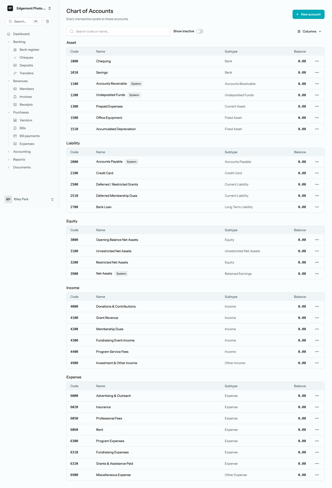

*Figure 12 — The full chart. Note the equity section is titled with net-asset accounts: Opening Balance Net Assets, Unrestricted Net Assets, Restricted Net Assets.*

> **Note.** The club's chequing account starts at **$0.00** because we left its opening balance blank — the club is starting fresh. If your club already has money in the bank, edit the Chequing account and enter the bank balance and the date it was true; LineLedger posts the opening entry for you.

## Adding an account you need

The standard chart covers most of a club's life, but sooner or later you'll want an account it doesn't have. The club's credit union charges a monthly service fee, and good bookkeeping gives bank fees their own expense account rather than burying them in *Miscellaneous Expense*.

Click **New account** and fill in:

| Field | Value |
|---|---|
| Code | 6010 |
| Name | Bank Charges |
| Type | Expense: Expense |

*Figure 13 — Adding 6010 Bank Charges. Codes in the 6000s keep it sorted with the other expenses.*

Click **Save**. The account appears in the expense section, ready for the bank reconciliation at month-end.

# Set Up a Membership Level

A membership level describes a kind of membership your club offers: what it's called, what it costs, how often it renews, and — importantly for the books — which revenue account its dues land in.

Open **Settings → Lists → Membership levels**.

*Figure 14 — Membership levels live under Settings → Lists.*

Click **New level** and create the club's first membership type:

| Field | Value |
|---|---|
| Name | Founding Member |
| Default dues | 10.00 |
| Billing frequency | Annual |
| Revenue account | 4200 — Membership Dues |
| Default terms | Due on receipt |

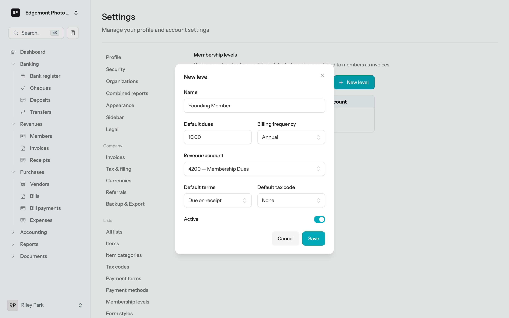
*Figure 15 — Founding Member: $10 per year, posting to 4200 Membership Dues, due on receipt.*

> **Tip.** The **revenue account** on the level is the magic. Every dues invoice generated from this level posts its revenue there automatically — you'll never pick an account by hand when billing members.

Click **Save**. The level is ready to assign.

*Figure 16 — One level, CA$10.00, Annual. Add as many levels as your club has membership types.*

# Add Your First Member

On January 5, Alex Tremblay signs up as the club's first Founding Member.

Open **Revenues → Members** in the sidebar and click **New member**. A member in LineLedger is a contact (name, email, address) plus a membership (level, dates, dues), created together on one form:

| Field | Value |
|---|---|
| Name | Alex Tremblay |
| Email | alex.tremblay@example.com |
| Membership level | Founding Member (CA$10.00) |
| Joined | 2026-01-05 |
| Term start | 2026-01-05 |
| Expires | 2027-01-04 |

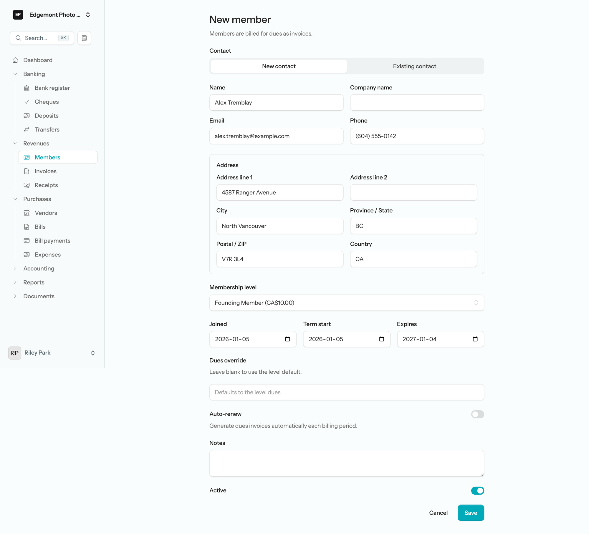
*Figure 17 — One form, two halves: who the member is, and what membership they hold.*

> **Note.** Leave **Dues override** blank to use the level's default ($10), and leave **Auto-renew** off for now — chapter 11 covers letting LineLedger generate renewal invoices automatically.

Click **Save** and you land on Alex's member page: membership number **MEM-000001**, level, status, key dates — and a **Bill dues now** button, which is where the bookkeeping begins.

*Figure 18 — The member page header. Below it, the page keeps a running list of every dues invoice for Alex — empty for a few more minutes.*

# Bill the Dues

Click **Bill dues now** on Alex's member page. LineLedger drafts a dues invoice and opens it for review — customer, memo, and the $10 line item already filled in from the membership level.

Two things to set, because the club is backdating to the day Alex actually joined:

1. **Date**: 2026-01-05
2. **Due date**: 2026-01-05 *(the level's terms are "due on receipt")*

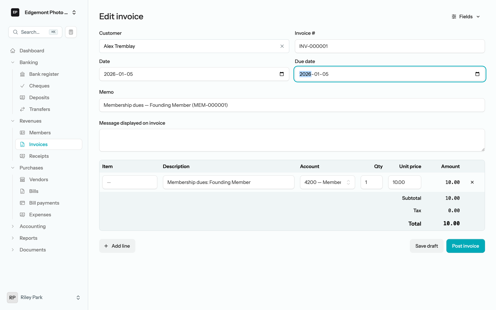
*Figure 19 — The drafted invoice: one line, "Membership dues: Founding Member", $10.00 to account 4200. No tax columns — the club isn't GST-registered.*

The invoice is still a **draft** — it hasn't touched the books. When it looks right, click **Post invoice**.

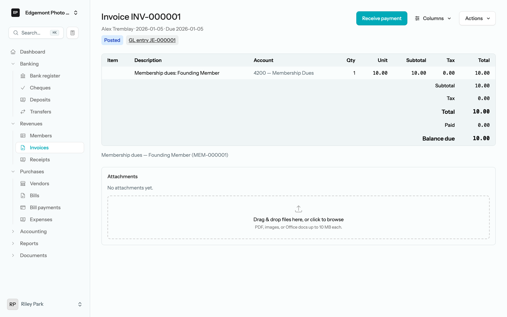
*Figure 20 — INV-000001, posted. Balance due $10.00. The "GL entry JE-000001" chip links to the exact ledger entry this invoice created.*

> **Why this matters.** Posting the invoice records revenue the club has *earned*, even though no cash has arrived yet — that's accrual accounting, and it's why your reports can distinguish "members owe us money" from "money in the bank." In ledger terms, posting INV-000001 moved $10 into Accounts Receivable and $10 into Membership Dues revenue:

| Account | Debit | Credit |
|---|---:|---:|
| 1100 — Accounts Receivable | $10.00 | |
| 4200 — Membership Dues | | $10.00 |

# Record the Payment

At the January 12 club meeting, Alex hands Riley a ten-dollar bill. Time to record it.

Open invoice INV-000001 and click **Receive payment**. The receipt form opens with the customer, amount, and invoice application already filled in. Set:

| Field | Value |
|---|---|
| Date | 2026-01-12 |
| Amount | 10.00 *(pre-filled)* |
| Deposit to | 1200 — Undeposited Funds *(the default)* |
| Payment method | Cash |

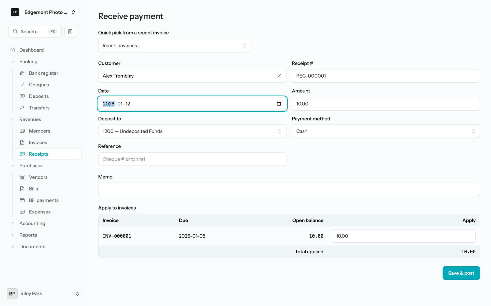
*Figure 21 — Receipt REC-000001: $10 cash, applied to INV-000001, held in Undeposited Funds.*

> **Why this matters.** **Undeposited Funds** is the envelope in the treasurer's desk drawer: money the club has received but hasn't taken to the bank yet. Recording cash there (instead of straight into Chequing) means your books can match the bank statement *exactly* — the bank sees one deposit on the day you visit the credit union, not a trickle of individual receipts.

Click **Save & post**. The invoice flips to **Paid**:

*Figure 22 — Paid in full. Balance due $0.00.*

The ledger entry behind REC-000001 — the $10 moves from "owed to us" to "in the drawer":

| Account | Debit | Credit |
|---|---:|---:|
| 1200 — Undeposited Funds | $10.00 | |
| 1100 — Accounts Receivable | | $10.00 |

# Make the Deposit

On January 15, Riley takes the cash to the credit union. Record it under **Banking → Deposits → New deposit**:

| Field | Value |
|---|---|
| Deposit to | 1000 — Chequing |
| Date | 2026-01-15 |
| Undeposited receipts | ✓ REC-000001 — Alex Tremblay — $10.00 |

Every receipt sitting in Undeposited Funds is listed with a checkbox, already ticked. With more members you'd collect several receipts into one deposit — one line on the bank statement, one deposit in the books.

*Figure 23 — DEP-000001: one $10 receipt deposited to Chequing on January 15.*

Click **Save & post**, then have a look at **Banking → Bank register**. The deposit is there and the ledger balance reads **$10.00** — cleared balance still $0.00, because nothing has been reconciled against a bank statement yet. That's the next chapter.

*Figure 24 — The Chequing register: ledger balance $10.00, cleared balance $0.00.*

The deposit's ledger entry — out of the drawer, into the bank:

| Account | Debit | Credit |
|---|---:|---:|
| 1000 — Chequing | $10.00 | |
| 1200 — Undeposited Funds | | $10.00 |

# Reconcile January

In early February the credit union's January statement arrives:

| Edgemont Community Credit Union — Statement, January 2026 | |
|---|---:|
| Opening balance, Jan 1 | $0.00 |
| Jan 15 — Deposit | +$10.00 |
| Jan 31 — Service charge | −$2.00 |
| **Closing balance, Jan 31** | **$8.00** |

Reconciling means proving your books against this statement, item by item, until the difference is zero. It's the treasurer's monthly act of accountability — and in LineLedger it takes about a minute.

> **Why this matters.** A reconciled month is the difference between "I think the books are right" and "the bank agrees the books are right." It catches missed transactions, double entries, and typos while they're days old instead of at year-end. Make it a monthly habit; your auditor (and your successor) will thank you.

## Begin the reconciliation

Open **Banking → Bank register**, then choose **Actions → Reconcile**, and click **Reconcile**. The *Begin reconciliation* dialog asks for the statement's bottom line — and right here is where you record the service charge, without leaving the flow:

| Field | Value |
|---|---|
| Statement date | 2026-01-31 |
| Beginning balance | 0.00 *(calculated for you)* |
| Ending balance | 8.00 |
| Service charge — Amount | 2.00 |
| Service charge — Date | 2026-01-31 |
| Service charge — Account | 6010 — Bank Charges |

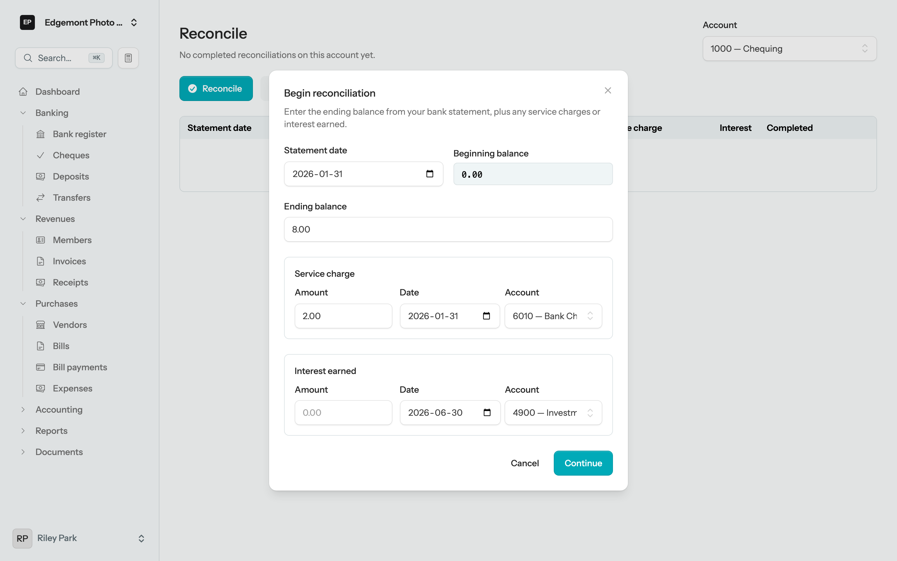
*Figure 25 — Statement date, ending balance, and the $2 service charge to the Bank Charges account from chapter 3.*

Click **Continue**. LineLedger posts the service charge for you and marks it cleared — it's on the statement, after all.

## Clear the transactions

The reconciliation screen shows two panes: money out (*Cheques and Payments*) and money in (*Deposits and Other Credits*), with a running summary pinned to the bottom. The service charge is already marked. The deposit isn't yet — and the summary shows the difference you still have to explain.

*Figure 26 — One item left to clear. Difference: $10.00 — exactly the unmarked deposit.*

Click the deposit to mark it cleared. The difference drops to **$0.00** and the **Reconcile now** button lights up.

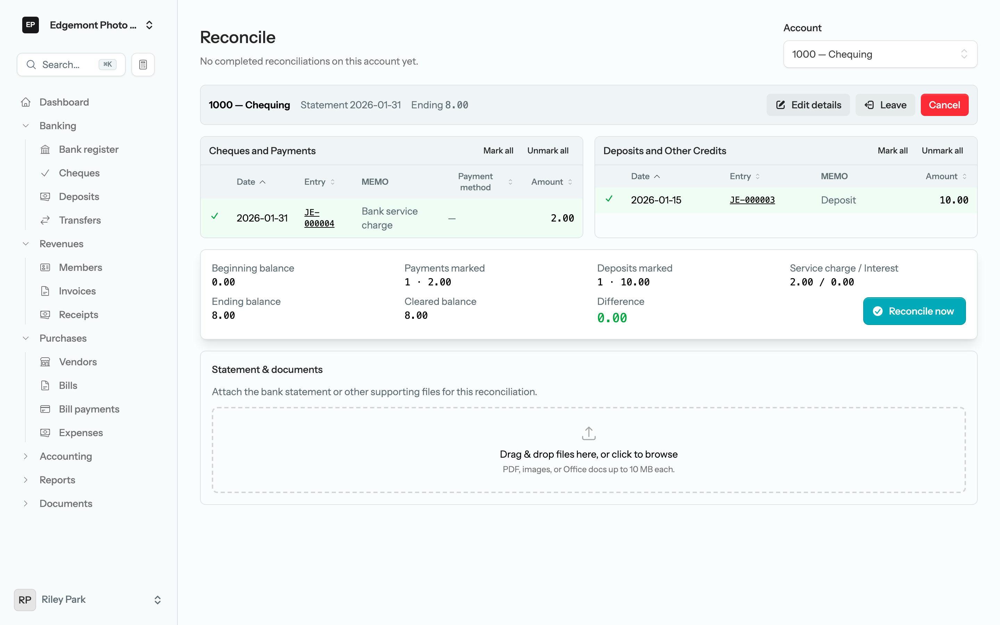
*Figure 27 — Cleared balance $8.00, ending balance $8.00, difference $0.00. The books match the bank.*

Click **Reconcile now**.

## The proof

LineLedger files the reconciliation and shows the permanent record: balances, the service charge, who completed it and when, and every item cleared. You can attach the bank statement PDF right on this page — future-you will be glad it's there.

*Figure 28 — Reconciliation #1, completed. Difference $0.00, one deposit and one payment cleared, statement attachable below.*

The service charge's ledger entry, which LineLedger posted from the dialog:

| Account | Debit | Credit |
|---|---:|---:|
| 6010 — Bank Charges | $2.00 | |
| 1000 — Chequing | | $2.00 |

# Read Your Month-End Reports

With January reconciled, the reports almost write the treasurer's report for you. Open **Reports** in the sidebar to see everything available; the four below are the monthly staples for a membership club.

*Figure 29 — The reports hub. Financial statements at the top; the membership roster lives with the member reports.*

## Balance sheet — what the club has

Set *As of* to **2026-01-31**. Total assets $8.00 (all of it in Chequing), no liabilities, and net assets of $8.00. Because the club is a non-profit, the equity section speaks the right language: **Net Assets**, with the year's surplus shown as *Excess (deficiency) of revenue over expenses*.

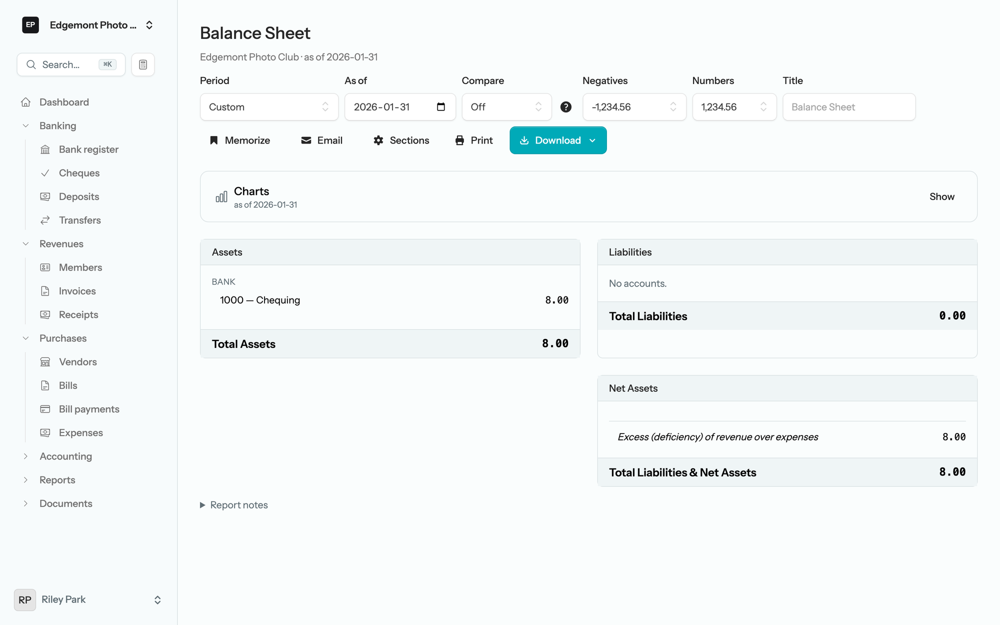
*Figure 30 — Assets = Liabilities + Net Assets: $8.00 = $0.00 + $8.00.*

## Income statement — what happened this month

Set the period to **January 1 – January 31, 2026**. Revenue $10.00 (Membership Dues), expenses $2.00 (Bank Charges), and the non-profit bottom line: **Excess of revenue over expenses, $8.00**.

*Figure 31 — January in one page: $10 in, $2 out, $8 kept.*

## Cash flow statement — where the money moved

Same period. Operating activities brought in $8.00 net, and ending cash is $8.00 — for a simple month it confirms the same story, and as the club grows it will explain months where surplus and cash *don't* move together (dues invoiced but not yet collected, for instance).

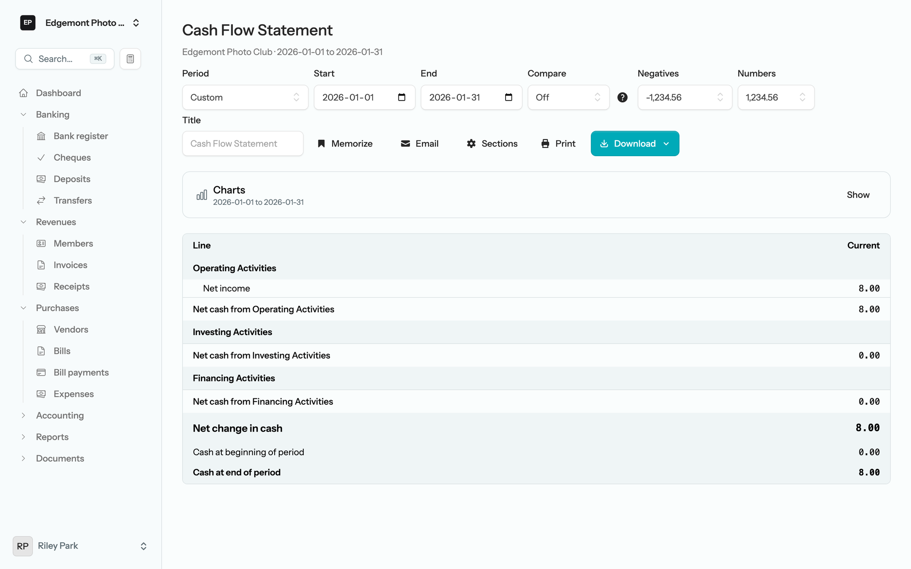
*Figure 32 — Net change in cash: +$8.00, ending cash $8.00.*

## Membership roster — who the club is

Under member reports, the roster lists every member with level, status, dates, and any open dues — Alex Tremblay, Founding Member, **Active**, nothing owing. The **Download** button exports it as PDF or XLSX for the AGM binder or the membership secretary.

*Figure 33 — One member strong, dues paid in full.*

> **Note.** Reports → Non-profit also offers statements titled the way many boards and funders expect them: the **Statement of Financial Position** (figure 34), **Statement of Operations**, and **Statement of Changes in Net Assets**. Same numbers, formal presentation.

*Figure 34 — The Statement of Financial Position as of January 31, 2026 — the balance sheet in its Sunday best.*

# Where to Go Next

January is closed: invoiced, collected, deposited, reconciled, and reported. A few directions worth exploring as the club grows:

- **Auto-renew dues.** Switch on *Auto-renew* on a member's page and LineLedger generates their renewal invoice each billing period — no February to-do list.
- **More members.** *Members → New member* is the whole flow; the roster, dues billing, and reports scale with you. Existing contacts can be made members too.
- **Invite the executive.** *Settings → Organizations* lets you invite the president or a co-signer with a role that matches what they should see — viewer access for the board, full books for a co-treasurer.
- **Import the bank statement.** The bank register's *Actions* menu imports CSV/OFX statement files and learns matching rules, so reconciliation gets even faster.
- **Donations & grants.** When the club starts fundraising, enable the *Donations & grants* feature in settings — the chart already has the accounts waiting.
- **In-app documentation.** The *Docs* section inside LineLedger covers every module in this guide and the ones you haven't met yet.

# Appendix A — January at a Glance

| Measure | Amount |
|---|---:|
| Membership revenue (4200) | $10.00 |
| Bank charges (6010) | $2.00 |
| **Excess of revenue over expenses** | **$8.00** |
| Cash in bank, January 31 | $8.00 |
| Accounts receivable, January 31 | $0.00 |
| Net assets, January 31 | $8.00 |
| Bank statement closing balance | $8.00 |
| Reconciliation difference | **$0.00** |

The treasurer's report, in one sentence: *the club earned $10 in founding-member dues, paid $2 in bank charges, and holds $8 at the credit union — reconciled to the bank statement with zero difference.*

# Appendix B — What Got Posted to the Ledger

Four documents touched the books in January. Here is each one's journal entry — the double-entry view of everything this guide did. Debits always equal credits, in every entry and in total.

**January 5 — Dues invoice INV-000001 posted**

| Account | Debit | Credit |
|---|---:|---:|
| 1100 — Accounts Receivable | $10.00 | |
| 4200 — Membership Dues | | $10.00 |

*The club earned dues revenue; Alex owes $10.*

**January 12 — Receipt REC-000001 (cash) posted**

| Account | Debit | Credit |
|---|---:|---:|
| 1200 — Undeposited Funds | $10.00 | |
| 1100 — Accounts Receivable | | $10.00 |

*Alex paid; the $10 sits in the drawer awaiting a bank run.*

**January 15 — Deposit DEP-000001 posted**

| Account | Debit | Credit |
|---|---:|---:|
| 1000 — Chequing | $10.00 | |
| 1200 — Undeposited Funds | | $10.00 |

*The $10 reached the bank.*

**January 31 — Bank service charge (posted from the reconciliation dialog)**

| Account | Debit | Credit |
|---|---:|---:|
| 6010 — Bank Charges | $2.00 | |
| 1000 — Chequing | | $2.00 |

*The credit union's monthly fee.*

**Closing trial balance, January 31, 2026**

| Account | Debit | Credit |
|---|---:|---:|
| 1000 — Chequing | $8.00 | |
| 1100 — Accounts Receivable | — | — |
| 1200 — Undeposited Funds | — | — |
| 4200 — Membership Dues | | $10.00 |
| 6010 — Bank Charges | $2.00 | |
| **Total** | **$10.00** | **$10.00** |

Every entry above is also visible inside LineLedger — each posted document links to its GL entry (you saw *JE-000001* on the invoice page), and every posting is recorded in a tamper-evident audit log. The books don't just balance; they can prove it.

*This guide was produced against LineLedger in June 2026 using a live organization; all figures are real output. To regenerate it, see `docs/manuals/README.md` in the LineLedger repository.*
